## 实验一：购买腾讯云服务器并登陆

#### 黄飞雄- 116072017008 -软件工程闽台合作

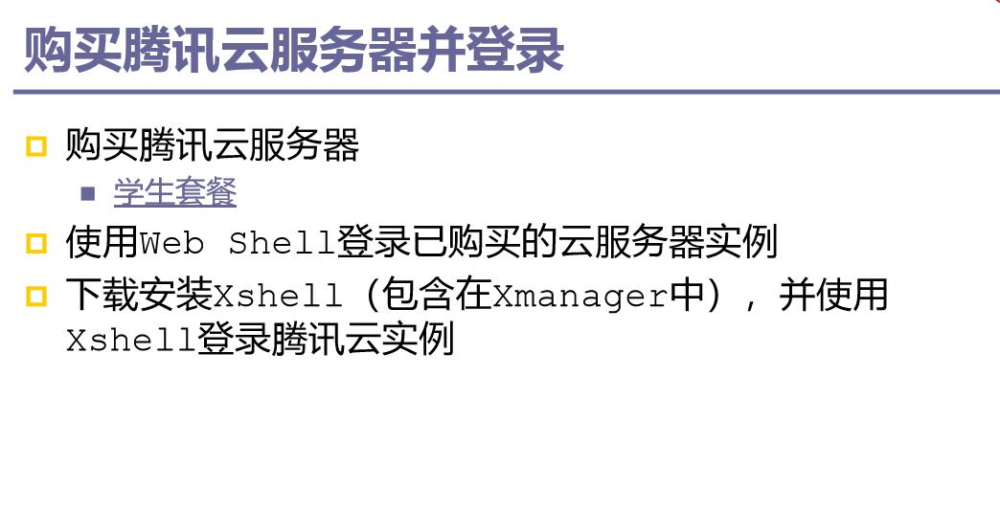

登陆腾讯云

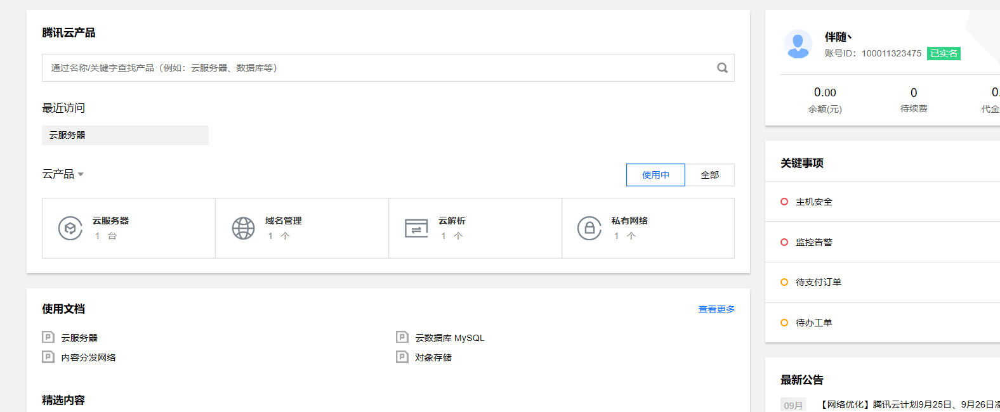

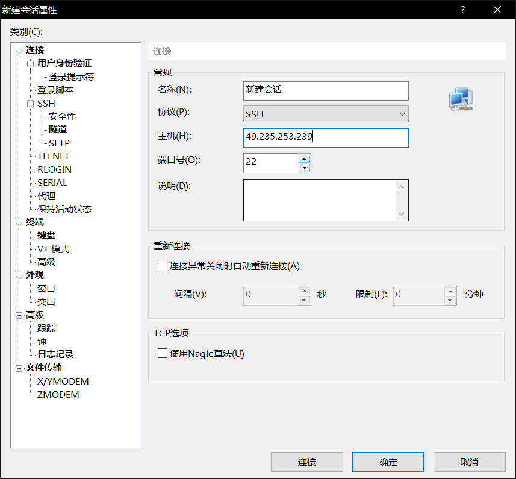

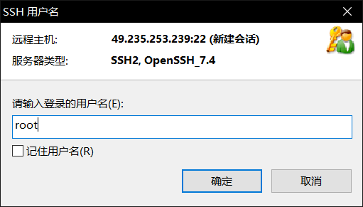

登陆xshell 使用xshell登陆腾讯云

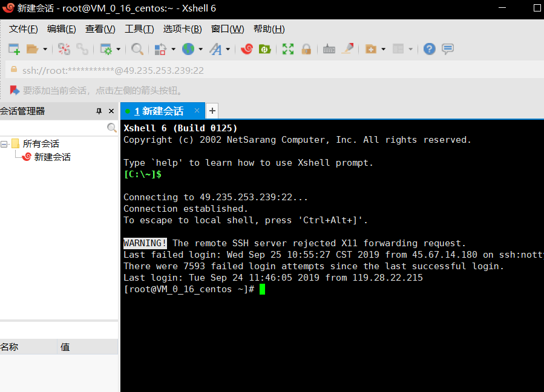

# 实验二 创建github项目并在本地同步

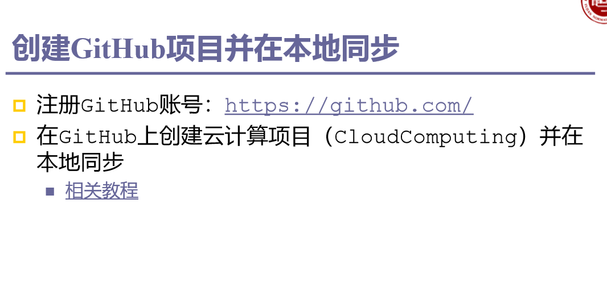

复制“id_rsa.pub”的内容到GitHub网站的Settings–>SSH and GPG keys中：

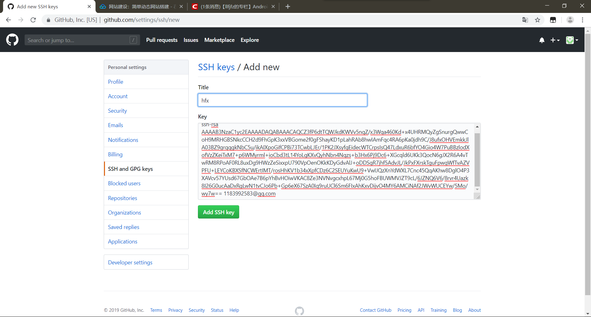

测试SSH Key是否配置成功：

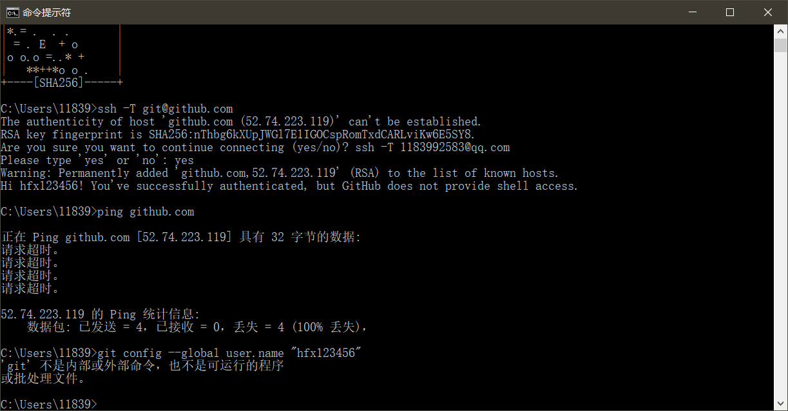

#### 配置GitHub的用户名和邮箱

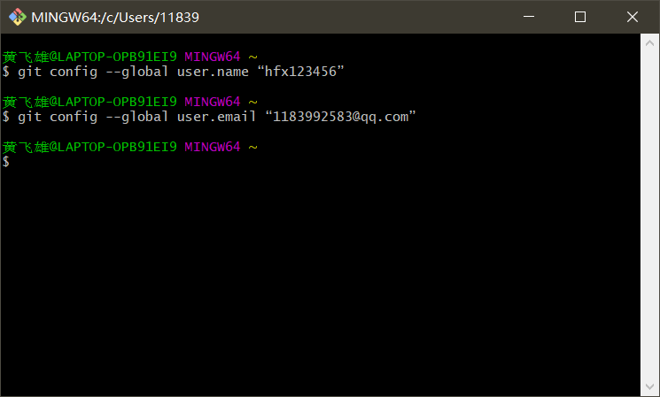

#### 创建GitHub项目并在本地进行同步

#### 访问GitHub网站并新建代码仓库

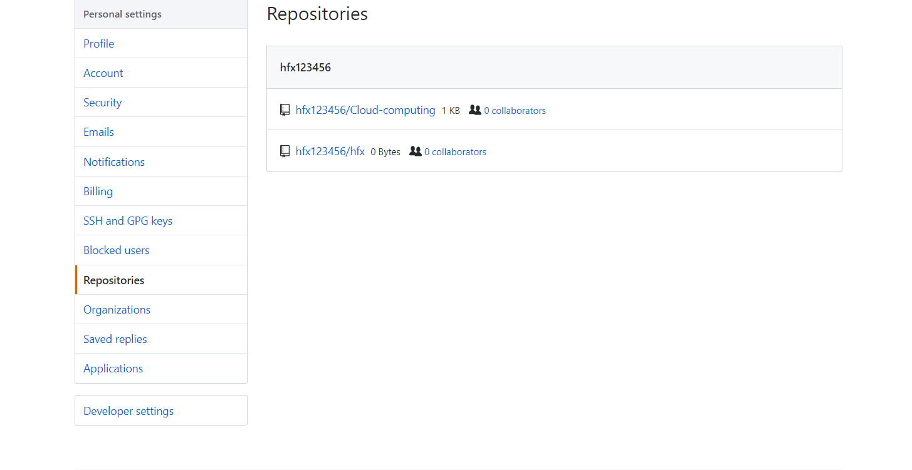

#### 创建本地代码仓库

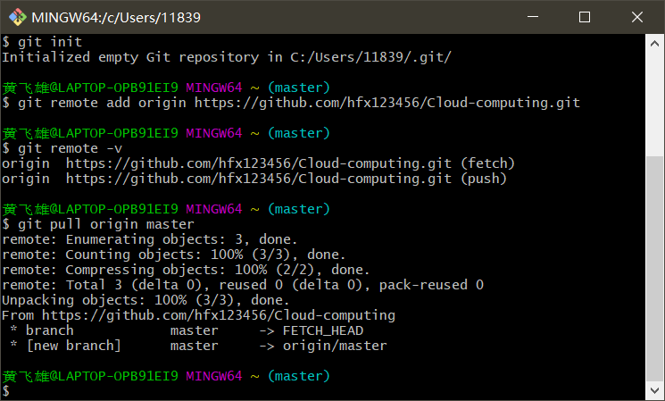

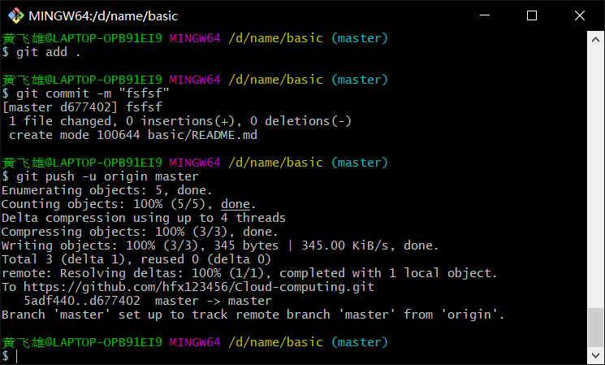

github上显示建立readme

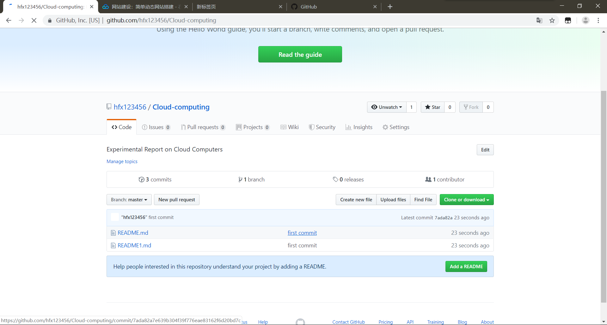

# 本地安装VMware和CentOS

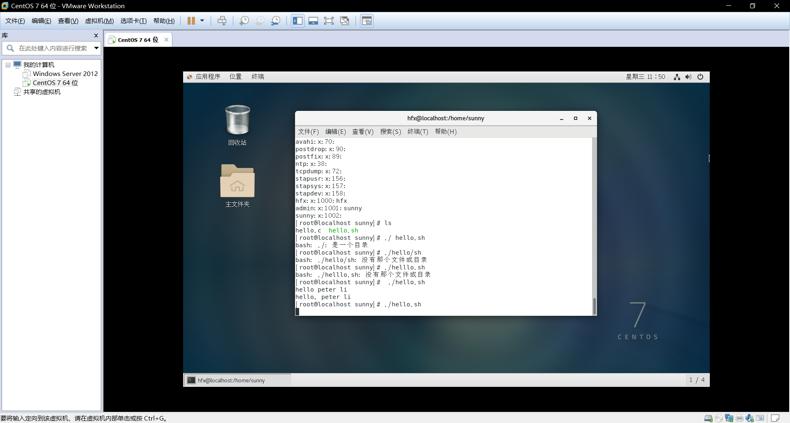