# Ceph的安装与实践

## Ceph安装的前序工作1

#### 1.先安装一台虚拟机（我选择的是有图形界面的虚拟机）

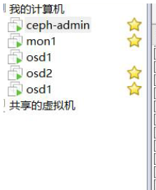

**添加cephuser 用户**

```
useradd -d /home/cephuser -m cephuser
passwd cephuser
```

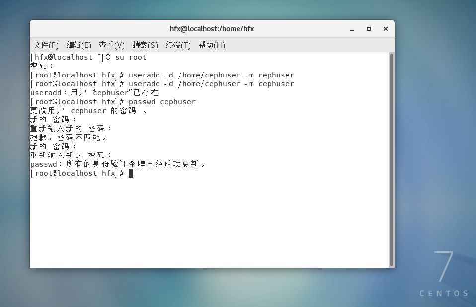

**配置sudo权限**

```
echo "cephuser ALL = (root) NOPASSWD:ALL" | sudo tee /etc/sudoers.d/cephuser
chmod 0440 /etc/sudoers.d/cephuser
sed -i s'/Defaults requiretty/#Defaults requiretty'/g /etc/sudoers
```

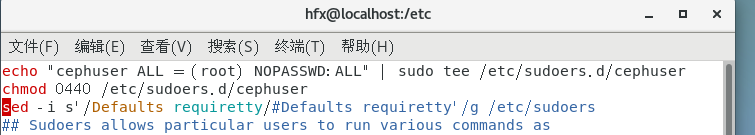

#### 安装和配置NTP

**安装NTP以同步所有节点上的日期和时间。运行ntpdate命令通过NTP协议设置日期和时间，我们将使用us pool NTP服务器。然后启动并启用NTP服务器在引导时运行。**

```
yum install -y ntp ntpdate ntp-doc
ntpdate 0.us.pool.ntp.org
hwclock --systohc
systemctl enable ntpd.service
systemctl start ntpd.service
```

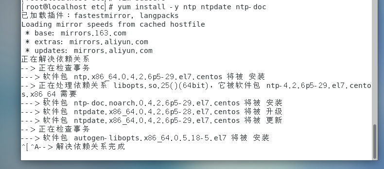

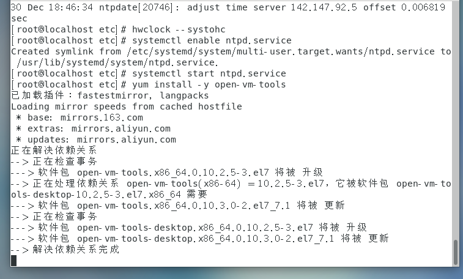

#### 安装Open-vm-tools

```
yum install -y open-vm-tools
```

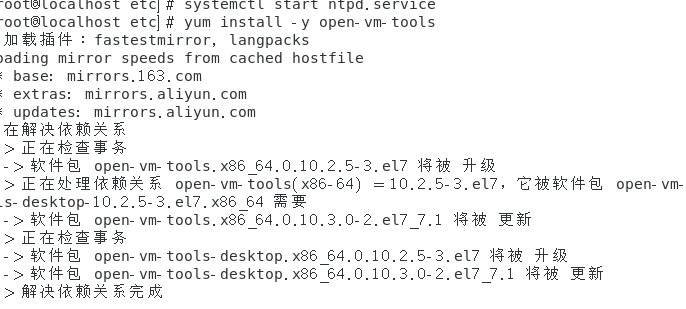

#### 禁止SELINUX**

```
sed -i 's/SELINUX=enforcing/SELINUX=disabled/g' /etc/selinux/config
```

**复制三台虚拟机**


#### 防火墙配置

**主控防火墙**

```
sudo firewall-cmd --zone=public --add-port=80/tcp --permanent

sudo firewall-cmd --zone=public --add-port=2003/tcp --permanent

sudo firewall-cmd --zone=public --add-port=4505-4506/tcp --permanent

sudo firewall-cmd --reload
```

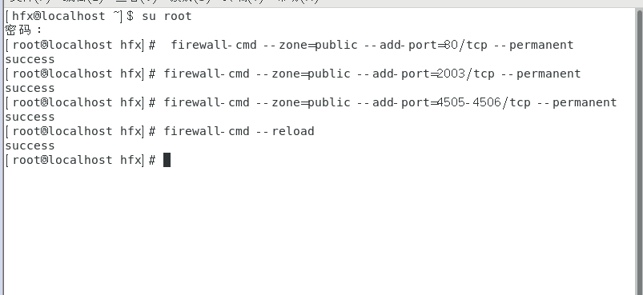

**监控防火墙**

```
sudo firewall-cmd --zone=public --add-port=6789/tcp --permanent

sudo firewall-cmd --reload
```

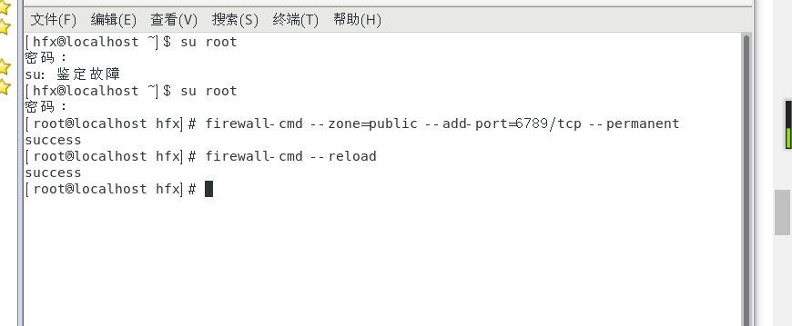

**普通防火墙**

```
sudo firewall-cmd --zone=public --add-port=6800-7300/tcp --permanent

sudo firewall-cmd --reload  (两台都要配)
```

### 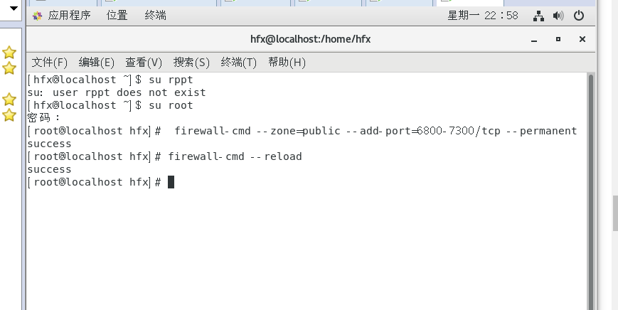

#### 配置SSH服务器

**使用vim编辑器在所有节点上编辑/ etc / hosts文件，并添加带有所有集群节点的IP地址和主机名的行。**

```
vim /etc/hosts
```

```
192.168.10.132        ceph-admin
192.168.10.134        mon1
192.168.10.136        osd1
182.168.10.135        osd2
```

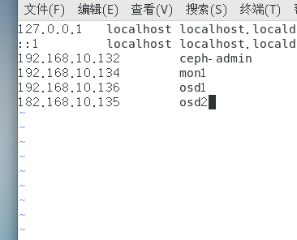

**保存文件并退出vim。**

**设置免密登录ssh**

```
su - cephuser
```

**生成密钥**

```
ssh-keygen
```

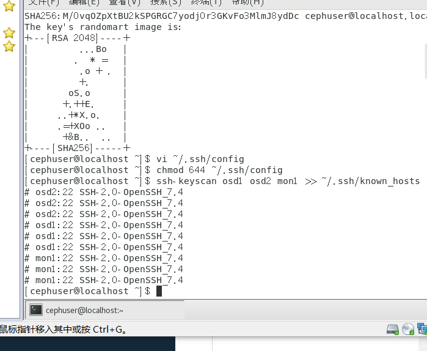

**接下来，为ssh配置创建配置文件。**

```
vim ~/.ssh/config
```

粘贴以下配置：

```
Host ceph-admin        
                       Hostname ceph-admin
                       User cephuser 
Host mon1        
                       Hostname mon1        
                       User cephuser 
Host osd1              
                       Hostname osd1        
                       User cephuser 
Host osd2        
                       Hostname osd2        
                       User cephuser 
```

**保存文件**

**更改文件的权限**

```
chmod 644 ~/.ssh/config

ssh-keyscan osd1 osd2 mon1 >> ~/.ssh/known_hosts
```


**现在，使用ssh-copy-id命令将SSH密钥添加到所有节点。***

```
ssh-copy-id ceph-admin

ssh-copy-id mon1

ssh-copy-id osd1

ssh-copy-id osd2
```

**根据要求输入您的“ cephuser”密码。**

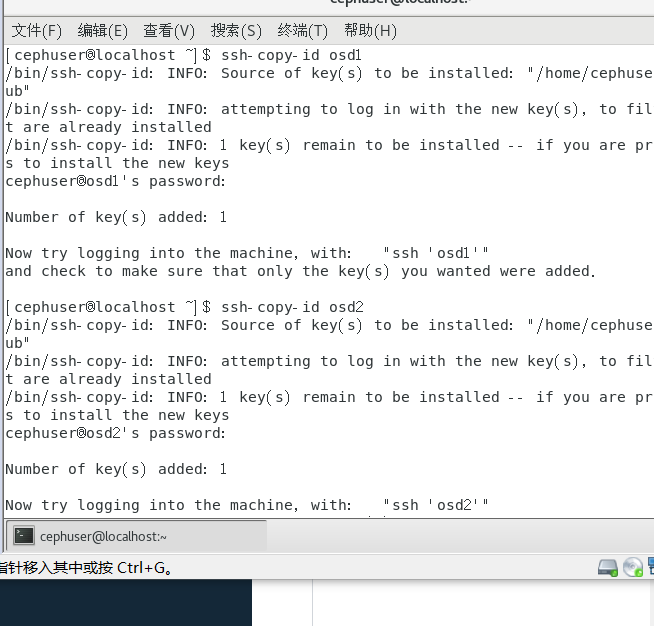

**完成后，请尝试从ceph-admin节点访问osd1服务器。**

```
ssh osd1
```

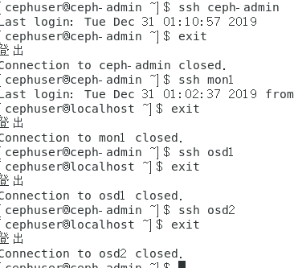

#### 在ceph-admin节点上安装ceph-deploy

```
yum install ceph-deploy
```

#### 创建新的集群配置

接下来，使用“ **ceph** **-deploy** ”命令创建一个新的集群配置，将监视节点定义为“ **mon1** ”。

```
mkdir cluster && cd cluster

ceph-deploy new mon1

vim ceph.conf
```

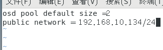

**在所有基线上安装Ceph**

```
ceph-deploy install ceph-admin mon1 osd1 osd2
```

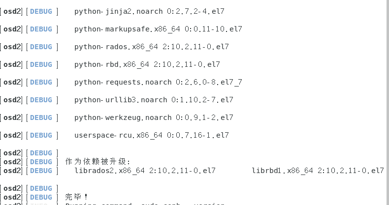

**查看ceph版本**

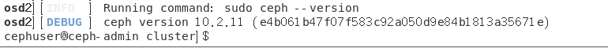

#### **主控预报**

```
ceph-deploy mon create-initial

ceph-deploy gatherkeys mon1
```

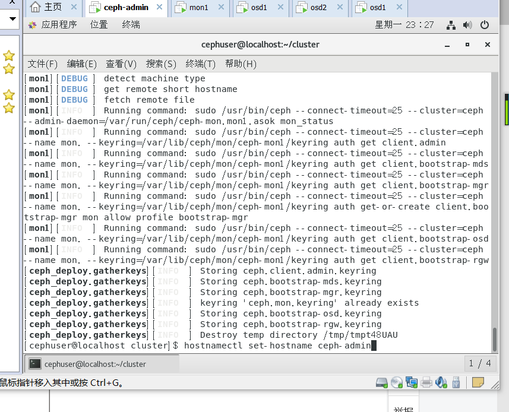

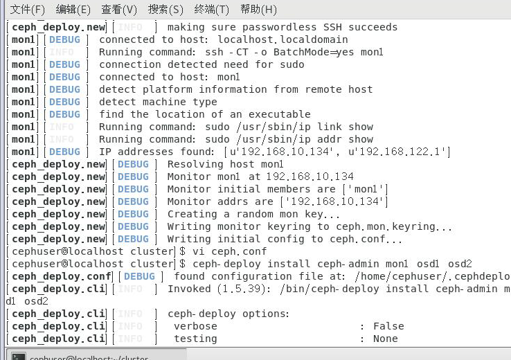

**为osd守护进程创建目录**

```
sudo mkdir /var/local/osd

sudo chown ceph: /var/local/osd
```

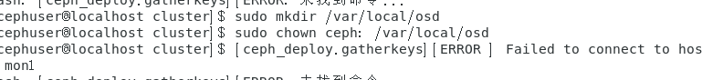

将管理密钥部署到所有关联的子系统。

```
准备所有OSDS节点
ceph-deploy osd prepare osd1:/var/local/osd osd2:/var/local/osd

激活OSD
ceph-deploy osd activate osd1:/var/local/osd osd2:/var/local/osd

将管理密钥部署到所有关联的节点。
ceph-deploy admin ceph-admin mon1 osd1 osd2
```

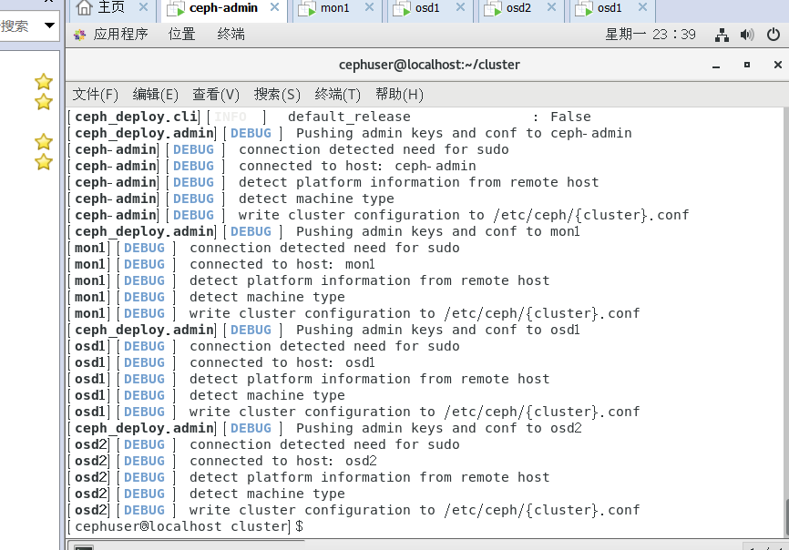

**更改权限**

```
sudo chmod 644 /etc/ceph/ceph.client.admin.keyring
```

## 测试Ceph设置

从**ceph** -admin节点登录到**ceph**监视服务器“ **mon1** ”。

```
ssh mon1
```

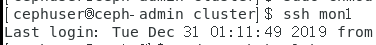

现在检查集群状态。

```
sudo ceph -s
```

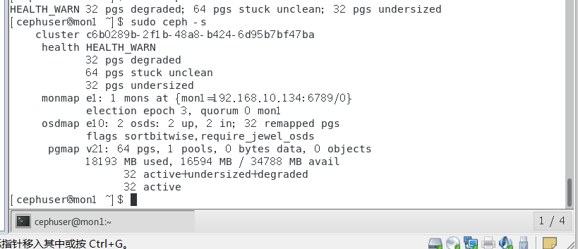