# 安装Docker

使用如下命令查看操作系统内核信息：

```
uname -r
```

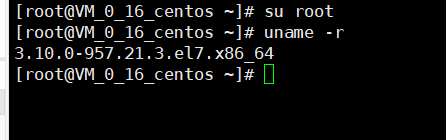

顺带看一下Linux的版本号：


```
cat /etc/redhat-release
```

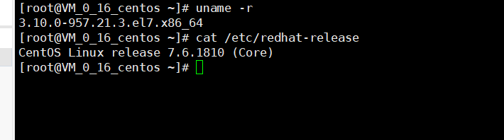

可见虚拟机是CentOS 7.6。

### **安装Docker**

**CentOS 7的应用程序库可能不是最新的，因此首先更新应用程序数据库：**

```
sudo yum check-update
```

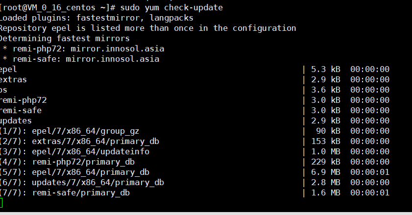

接下来添加Docker的官方仓库，下载最新的Docker并安装：

```
curl -fsSL https://get.docker.com/ | sh
```

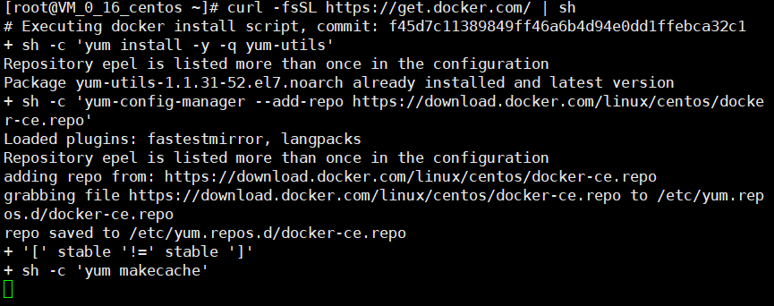

安装完成之后启动Docker守护进程，即Docker服务：

```
sudo systemctl start docker
```

验证Docker是否成功启动：

```
sudo systemctl status docker
```

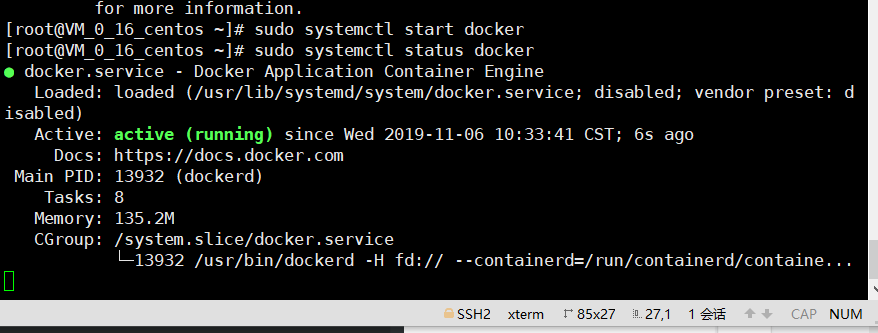

最后，确保Docker当服务器启动时自启动：

```
sudo systemctl enable docker
```

此外，还可以查看一下Docker的版本信息：

```
docker version
```

输出如图：

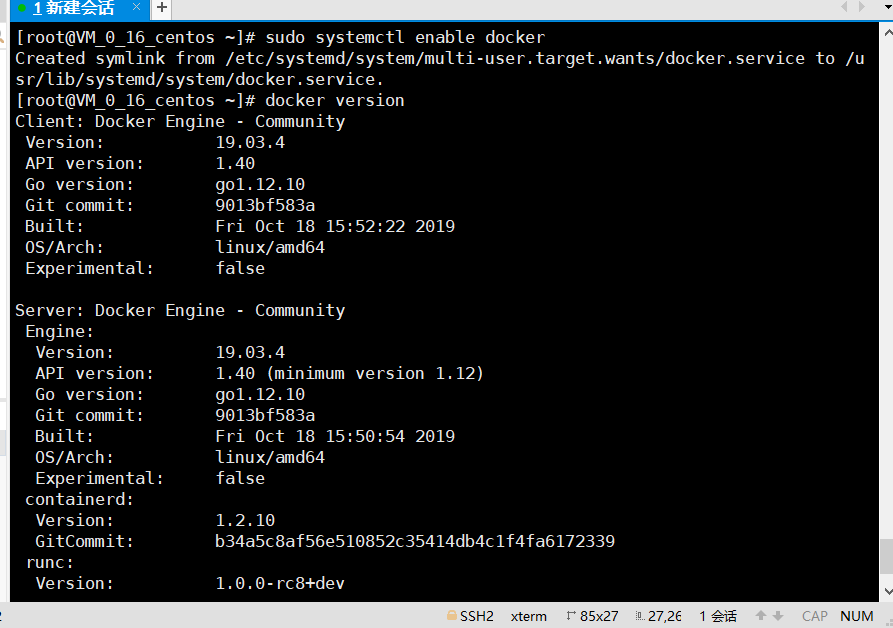

# 完成Docker安装之后加载CentOS镜像

## Docker基本操作

### Docker的命令使用

注意：Docker的操作需要用户获得root权限。

```
Docker命令的基本格式：
```

```
docker [选项] [命令] [参数]
```

查看docker所有的命令，键入：

```
docker
```

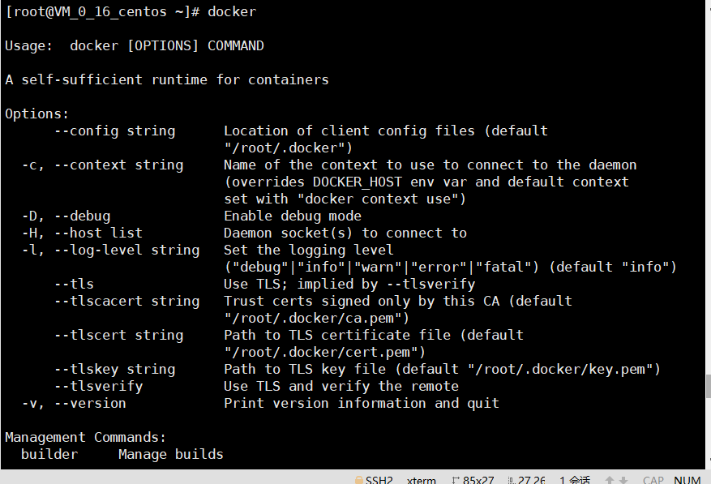

特定命令的使用帮助：

```
docker 特定命令 --help
```

查看当前系统docker的相关信息：

```
docker info
```

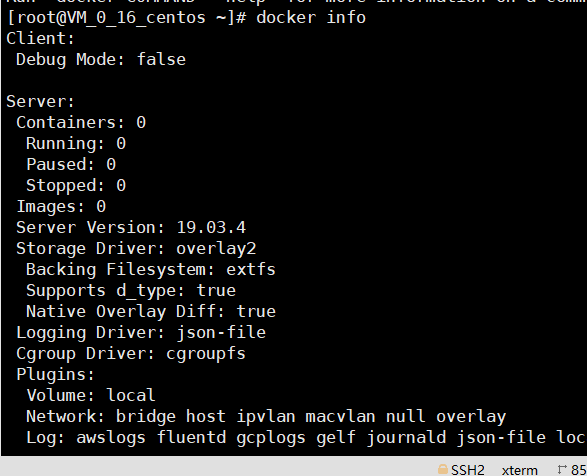

可见当前并未安装任何镜像（Images），运行任何容器（Containers）。

### 加载Docker镜像

Docker镜像是容器运行的基础，默认情况下，将从Docker Hub拉取镜像。首先使用search命令查询Docker Hub中的可用镜像，这里以查询可用的CentOS镜像为例：

```
docker search centos
```

命令从Docker Hub拉取centos镜像的相关信息，并返回可用镜像的列表，输出结果类似于：

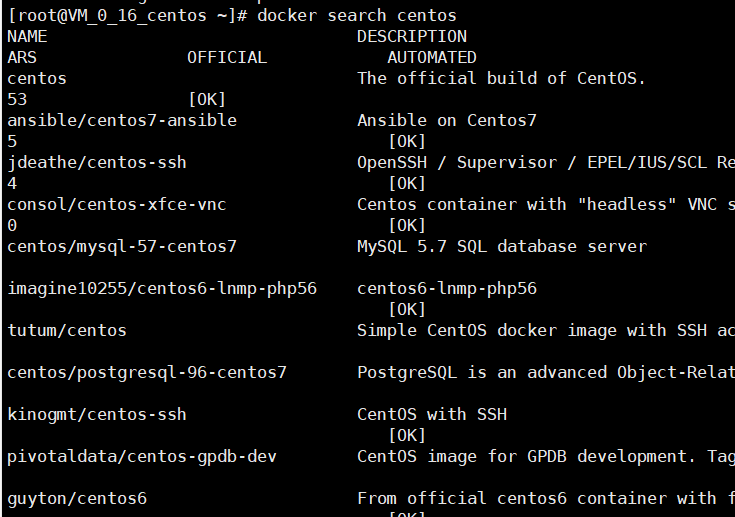

接下来拉取官方版本(OFFICIAL)的镜像：

```
docker pull centos:7
```

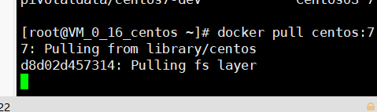

一旦镜像下载完成，可以基于该镜像运行容器，使用run命令：

```
docker run centos
```

查看一下当前系统中存在的镜像：

```
docker images
```

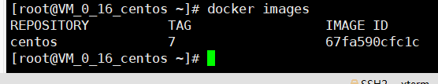


### 运行Docker容器

**运行Docker容器（为了方便检测后续wordpress搭建是否成功，需设置端口映射（-p），将容器端口80 映射到主机端口8888，Apache和MySQL需要 systemctl 管理服务启动，需要加上参数 –privileged 来增加权，并且不能使用默认的bash，换成 init，否则会提示 Failed to get D-Bus connection: Operation not permitted ，-name 容器名 ，命令如下 ）**

```
docker run -d -it --privileged --name wordpress -p 8888:80 -d centos:7 /usr/sbin/init
```

**查看已启动的容器**

```
docker ps
```

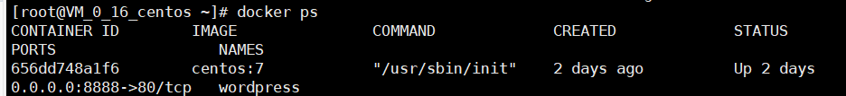

**进入容器前台（容器id可以只写前几位，如 ：f14）**

```
docker exec -it 656 /bin/bash
```

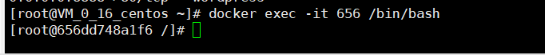

## 创建新的镜像

 

在前序操作的基础上，本小节将创建新的镜像，即提交更改到新的镜像。首先从容器的交互shell退出并保存状态，使用exit命令

```
exit
```

我们首先使用如下命令查看本地中的容器：

```
 docker ps -a
```

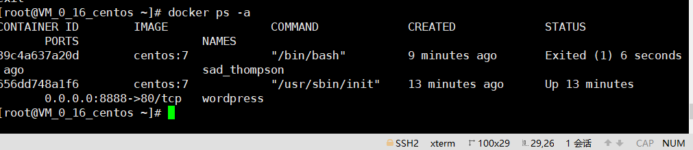

现在使用commit命令来提交更改到新的镜像中，即创建新的镜像。命令格式

```
docker commit [OPTIONS] CONTAINER [REPOSITORY[:TAG]]
```

例如：

```
docker commit -a "1183992583" -m "wordpress on centos7" 656dd748a1f6 1183992583/centos:v1
```

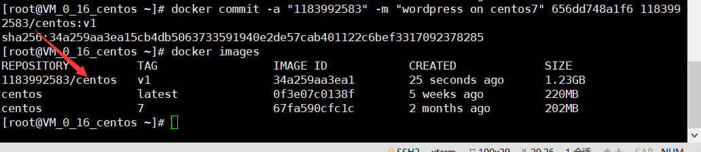

```
docker images
```

可以看到新生成的镜像:

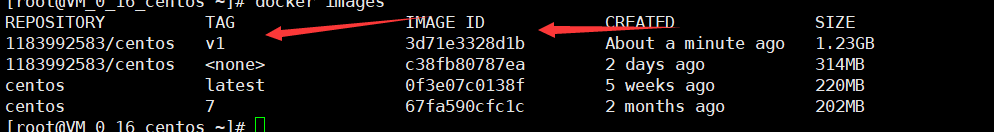


### 在该容器实例中安装WordPress并制作成镜像，参考： 

1.安装Apache Web服务器
使用yum工具安装：

```
yum install httpd
```

sudo命令获得了root用户的执行权限，因此需要验证用户口令。
 安装完成之后，启动Apache Web服务器：

```
systemctl start httpd.service
```

测试Apache服务器是否成功运行，找到腾讯云实例的公有IP地址(your_cvm_ip)，在你本地主机的浏览器上输入：

```
http://49.235.253.239:8888/
```

### 2.安装MySQL

CentOS 7.2的yum源中并末包含MySQL，需要其他方式手动安装。因此，我们采用MySQL数据库的开源分支MariaDB作为替代。
 安装MariaDB：

```
sudo yum install mariadb-server mariadb
```

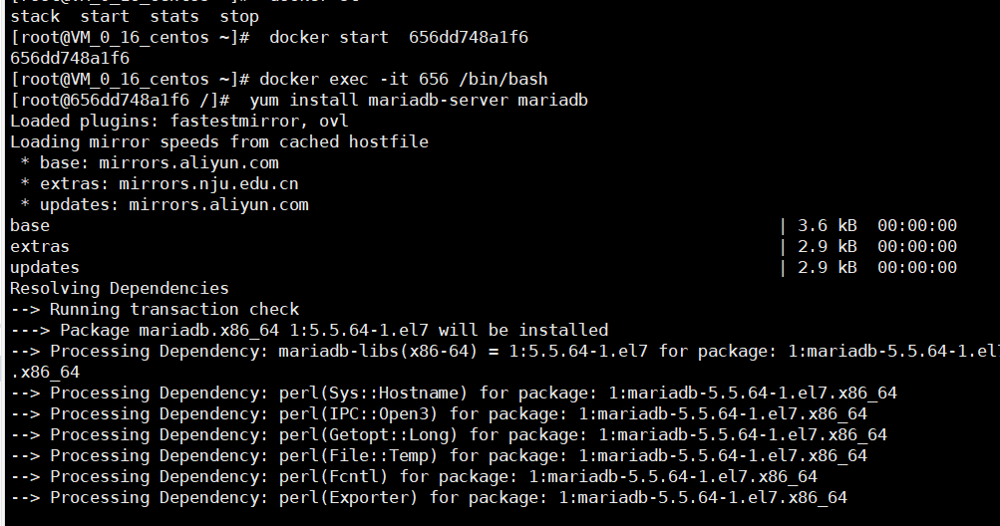

安装好之后，启动mariadb：

```
sudo systemctl start mariadb
```

随后，运行简单的安全脚本以移除潜在的安全风险，启动交互脚本：

```
sudo mysql_secure_installation
```

设置相应的root访问密码以及相关的设置(都选择Y)。
 最后设置开机启动MariaDB：

```
sudo systemctl enable mariadb.service
```

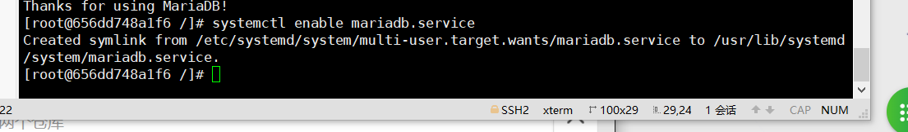

### **3.安装PHP**

```
sudo yum install epel-release yum-utils
sudo yum install http://rpms.remirepo.net/enterprise/remi-release-7.rpm
```

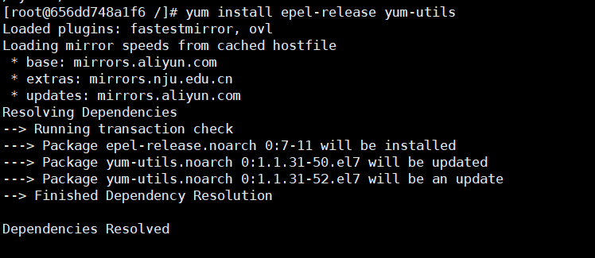

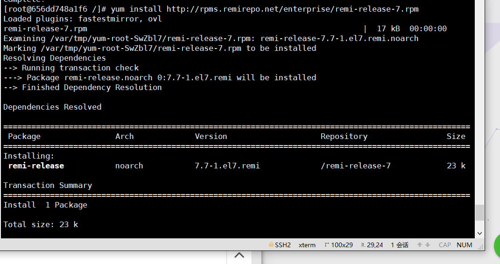

接着启用PHP 7.2 Remi仓库：

```
sudo yum-config-manager --enable remi-php72
```

安装PHP以及php-mysql

```
sudo yum install php php-mysql
```

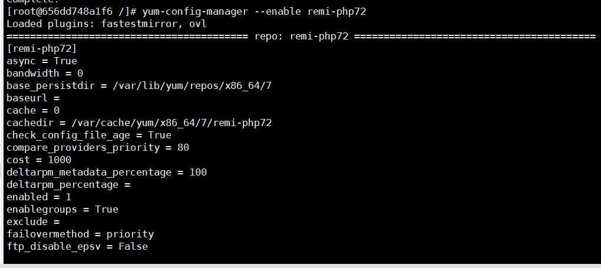

安装之后，重启Apache服务器以支持PHP：

```
sudo systemctl restart httpd.service
```

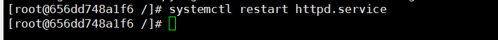

### 安装PHP模块

这里先行安装php-fpm(PHP FastCGI Process Manager)和php-gd(A module for PHP 

```
sudo yum install php-fpm php-gd
```

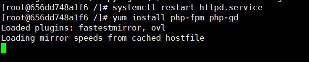

该命令使用vim在/var/www/html/处创建一个空白文件info.php，我们添加如下内容：

```
<?php phpinfo(); ?>
```

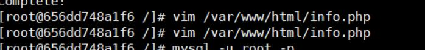

完成之后，使用刚才获取的cvm的IP地址，在你的本地主机的浏览器中输入:

```
http://49.235.253.239:8888/info.php
```

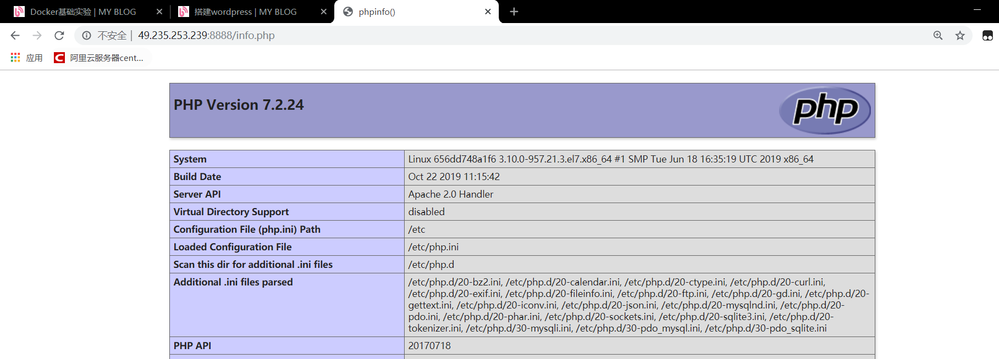

### 安装WordPress以及完成相关配置

#### (1)为WordPress创建一个MySQL数据库

首先以root用户登录MySQL数据库：

```
mysql -u root -p
```

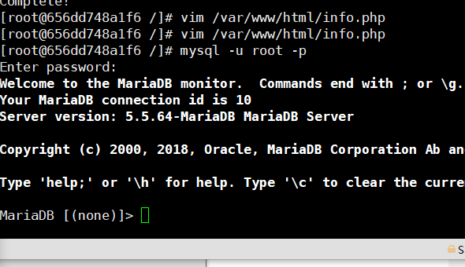

首先为WordPress创建一个新的数据库：

```
CREATE DATABASE wordpress;
```

注意：MySQL的语句都以分号结尾。
 接着为WordPress创建一个独立的MySQL用户：

```
CREATE USER hfx@localhost IDENTIFIED BY '1314520.qaz';
```

随后刷新MySQL的权限：

```
FLUSH PRIVILEGES;
```

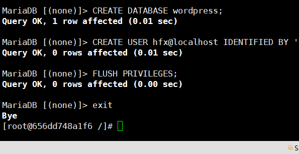

#### **(2)安装WordPress**

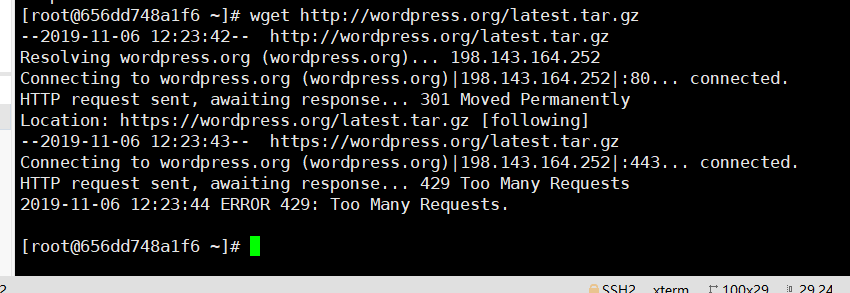

网站被墙了 不能直接用wget下载

所以采用复制的方法 ，从原本的虚拟机复制到容器

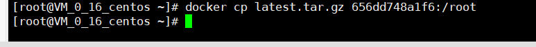

wget命令从WordPress官方网站下载最新的WordPress集成压缩包，解压该文件：

```
tar xzvf latest.tar.gz
```

解压之后在主目录下产生一个wordpress文件夹。我们将该文件夹下的内容同步到Apache服务器的根目录下，使得wordpress的内容能够被访问。这里使用rsync命令：

```
sudo rsync -avP ~/wordpress/ /var/www/html/
```

接着在Apache服务器目录下为wordpress创建一个文件夹来保存上传的文件：

```
mkdir /var/www/html/wp-content/uploads
```

对Apache服务器的目录以及wordpress相关文件夹设置访问权限：

```
chown -R apache:apache /var/www/html/*
```

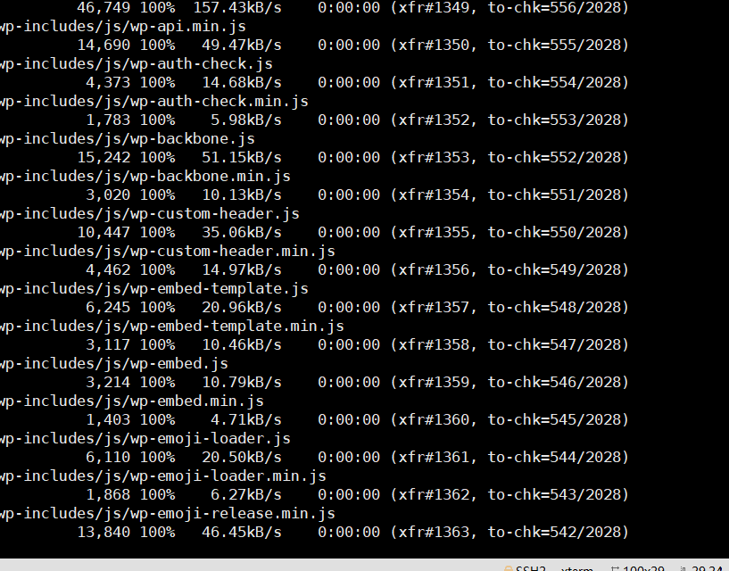

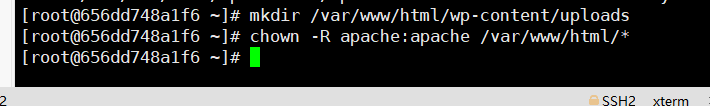

#### **(3)配置WordPress**

大多数的WordPress配置可以通过其Web页面完成，但首先通过命令行连接WordPress和MySQL。
 定位到wordpress所在文件夹：

```
cd /var/www/html
```

WordPress的配置依赖于wp-config.php文件，当前该文件夹下并没有该文件，我们通过拷贝wp-config-sample.php文件来生成：

```
cp wp-config-sample.php wp-config.php
```

然后修改配置，主要是MySQL相关配置：

```
vim wp-config.php
```

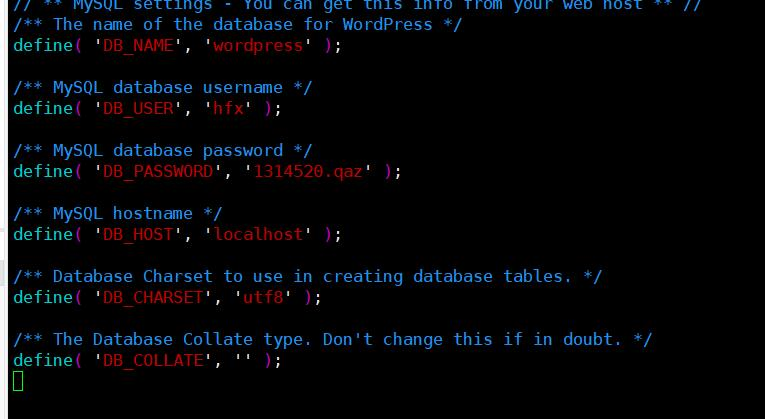

#### (4)通过Web界面进一步配置WordPress

经过上述的安装和配置，WordPress运行的相关组件已经就绪，接下来通过WordPress提供的Web页面进一步配置。输入你的IP地址或者域名：

```
http://49.235.253.239:8888/
```

出现如下界面：

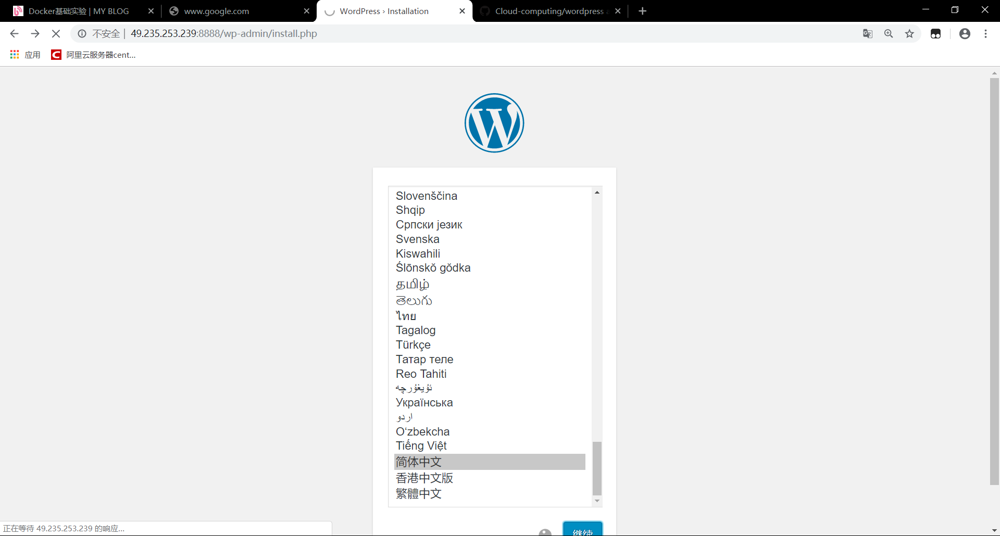

设置网站的标题，用户名和密码以及电子邮件等，点击**Install WordPress**，弹出确认页面：

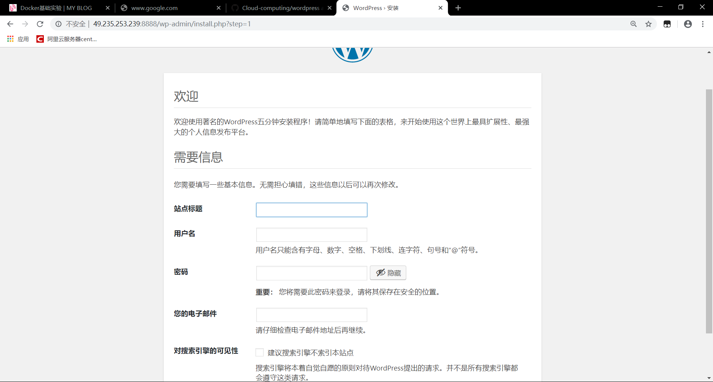

输入用户名和密码之后，进入WordPress的控制面板：

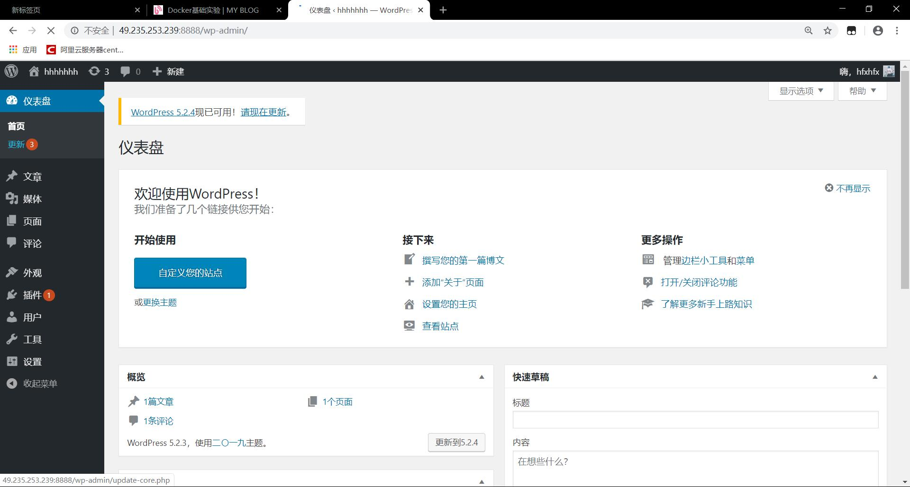

### 将带有WordPress的CentOS镜像推送到容器仓库

#### 将容器生成镜像 

```
docker commit -a "1183992583" -m "wordpress on centos7" 656dd748a1f6 1183992583/centos:v1
```


**登录Docker**

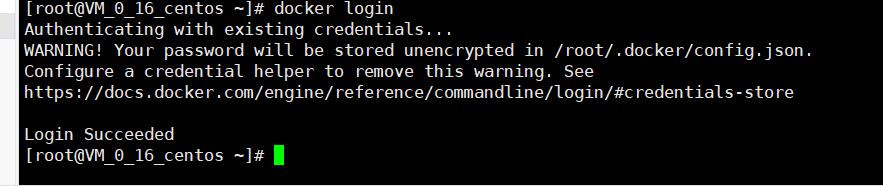

**推送镜像**

```
docker push 1183992583/centos:v1
```

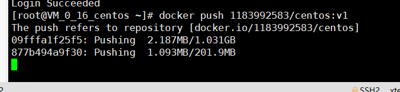

**登录Docker网页查看仓库**

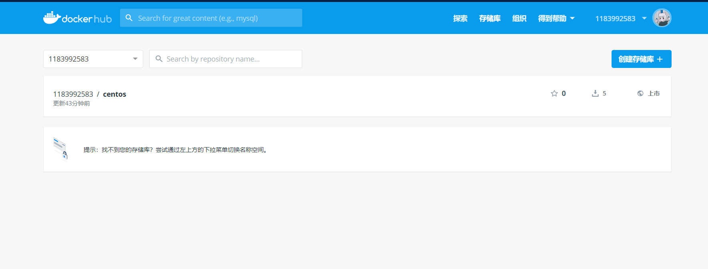

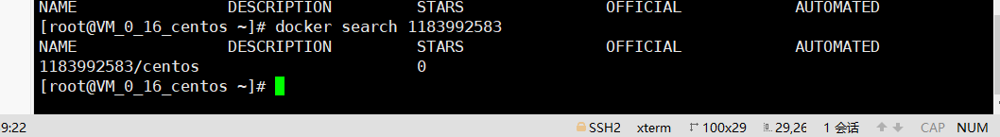

# 遇到的困难

#### ① ：不能使用sudo命令 

#### ②：不能使用vim，必须自己去安装vim

```
yum  -y  install  vim*
```

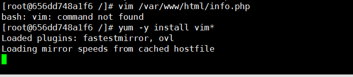

#### ③wget不行

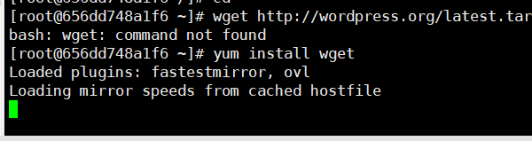

```
yum install wget
```

#### ④ word press的网址连接不上了

解决方法： 用虚拟机复制到docker里


#### ⑤没有httpd


**1.安装httpd服务**

```
yum install httpd 
```

**2.重启httpd服务**

```
systemctl start httpd.service
```

**3.关闭防火墙**

```
systemctl stop iptables.service
```

#### ⑥**运行Docker容器（为了方便检测后续wordpress搭建是否成功，需设置端口映射（-p），将容器端口80 映射到主机端口8888**

不然实验二做的网页会被覆盖掉

```
docker run -d -it --privileged --name wordpress -p 8888:80 -d centos:7 /usr/sbin/init
```

#### ⑦bash: service: command not found 错误

```
yum install initscripts -y
```

# 总结

本次实验的docker容器里什么都没有 很多东西都得自己安装，刚开始很不习惯，后来就熟悉了，还有wordpress被墙了，只能复制原本虚拟机的安装包。