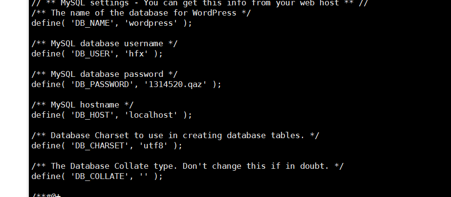

# 基于腾讯云创建个人网站

####  ***使用WordPress创建个人网站*** 

# 部署环境：LAMP	

 

- **云操作系统：CentOS 7.2 64位；**
- **HTTP服务器：Apache Web 服务器；**
- **数据库：MySQL；**
- **建站工具：WordPress（基于PHP）**


# 步骤

 

## 1.安装Apache Web服务器

**使用yum工具安装：**

 

```
sudo yum install httpd
```


 

**sudo命令获得了root用户的执行权限，因此需要验证用户口令。****
 **安装完成之后，启动Apache Web服务器：****

 

```
sudo systemctl start httpd.service
```


**测试Apache服务器是否成功运行，找到腾讯云实例的公有IP地址(your_cvm_ip)，在你本地主机的浏览器上输入：**

****

```
http://49.235.253.239/
```


## 2.安装MySQL

****

**CentOS 7.2的yum源中并末包含MySQL，需要其他方式手动安装。因此，我们采用MySQL数据库的开源分支MariaDB作为替代。**
 **安装MariaDB：**

 

```
sudo yum install mariadb-server mariadb
```


**安装好之后，启动mariadb**：


 

```
sudo systemctl start mariadb
```


***设置相应的root访问密码以及相关的设置(都选择Y)。****
 **最后设置开机启动MariaDB：**

****

```
sudo systemctl enable mariadb.service
```


## 3.安装PHP

 

PHP是一种网页开发语言，能够运行脚本，连接MySQL数据库，并显示动态网页内容。

1. PHP 7.x包在许多仓库中都包含，这里我们使用Remi仓库，而Remi仓库依赖于EPEL仓库，因此首先启用这两个仓库

   ```
   sudo yum install epel-release yum-utils
   ```

   


```
sudo yum install http://rpms.remirepo.net/enterprise/remi-release-7.rpm
```


**接着启用PHP 7.2 Remi仓库：**

 

```
sudo yum-config-manager --enable remi-php72
```


**安装PHP以及php-mysql**

```
sudo yum install php php-mysql
```


查看安装的php版本：

```
php -v
```


安装PHP模块

 

为了更好的运行PHP，需要启动PHP附加模块，使用如下命令可以查看可用模块：

 

```
yum search php-
```

****


**这里先行安装php-fpm(PHP FastCGI Process Manager)和php-gd(A module for PHP applications for using the gd graphics library)，WordPress使用php-gd进行图片的缩放。**

```
sudo yum install php-fpm php-gd
```


重启Apache服务：

```
sudo service httpd restart
```


## 4.测试PHP

 

**这里我们利用一个简单的信息显示页面（info.php）测试PHP。创建info.php并将其置于Web服务的根目录（/var/www/html/）：**

```
sudo vim /var/www/html/info.php
```

**该命令使用vim在/var/www/html/处创建一个空白文件info.php，我们添加如下内容：**

```
<?php phpinfo(); ?>
```

完成之后，使用刚才获取的cvm的IP地址，在你的本地主机的浏览器中输入:

 

```
http://49.235.253.239/info.php
```


## 5.安装WordPress以及完成相关配置

### (1)为WordPress创建一个MySQL数据库 

首先以root用户登录MySQL数据库： 

```
mysql -u root -p
```

首先为WordPress创建一个新的数据库：

 

```
CREATE DATABASE wordpress;
```

 

注意：MySQL的语句都以分号结尾。

接着为WordPress创建一个独立的MySQL用户

```
CREATE USER wordpressuser@localhost IDENTIFIED BY 'password';
```


“wordpressuser”和“password”使用你自定义的用户名和密码。授权给wordpressuser用户访问数据库的权限：

```
GRANT ALL PRIVILEGES ON wordpress.* TO wordpressuser@localhost IDENTIFIED BY 'password';
```

随后刷新MySQL的权限：

```
FLUSH PRIVILEGES;
```

最后，退出MySQL的命令行模式：

```
exit
```


### (2)安装WordPress

 

下载WordPress至当前用户的主目录：

 

```
cd ~
wget http://wordpress.org/latest.tar.gz
```


wget命令从WordPress官方网站下载最新的WordPress集成压缩包，解压该文件：

 

```
tar xzvf latest.tar.gz
```


解压之后在主目录下产生一个wordpress文件夹。我们将该文件夹下的内容同步到Apache服务器的根目录下，使得wordpress的内容能够被访问。这里使用rsync命令：

 

```
sudo rsync -avP ~/wordpress/ /var/www/html/
```

接着在Apache服务器目录下为wordpress创建一个文件夹来保存上传的文件：

 对Apache服务器的目录以及wordpress相关文件夹设置访问权限：

```
sudo chown -R apache:apache /var/www/html/*
mkdir /var/www/html/wp-content/uploads
```


### (3)配置WordPress

 

****大多数的WordPress配置可以通过其Web页面完成，但首先通过命令行连接WordPress和MySQL。**
 定位到wordpress所在文件夹：**

```
cd /var/www/html
```

WordPress的配置依赖于wp-config.php文件，当前该文件夹下并没有该文件，我们通过拷贝wp-config-sample.php文件来生成：

```
cp wp-config-sample.php wp-config.php
```


然后，通过nano超简单文本编辑器来修改配置，主要是MySQL相关配置：

 

```
nano wp-config.php
```



将文件中的DB_NAME，DB_USER和DB_PASSWORD更改成之前为WordPress创建的数据库的相关信息，这三处信息是当前唯一需要修改的。

### (4)通过Web界面进一步配置WordPress

 

经过上述的安装和配置，WordPress运行的相关组件已经就绪，接下来通过WordPress提供的Web页面进一步配置。输入你的IP地址或者域名：

 

```
http://49.235.253.239
```


设置网站的标题，用户名和密码以及电子邮件等，点击**Install WordPress**，弹出确认页面：


点击**Log In**，弹出登录界面：

**输入用户名和密码之后，进入WordPress的控制面板：**


